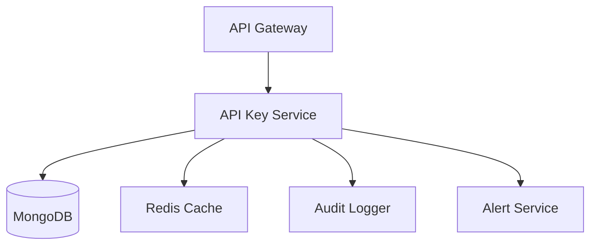
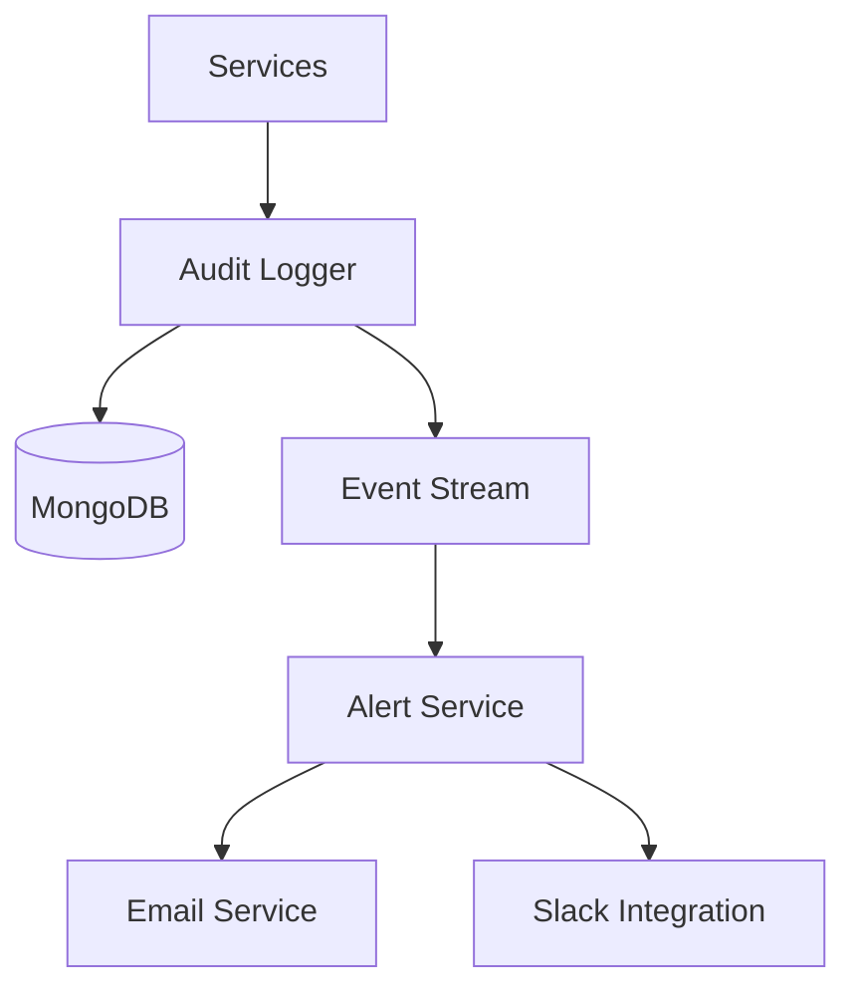

# System Architecture Documentation

## Overview
The SpendSync backend implements a secure API key management and audit logging system designed for high availability, scalability, and reliability. The system follows microservices architecture principles and implements robust security measures.

## System Components

### 1. API Key Management Service


#### Components:
- **API Key Service**: Core service for key management
- **MongoDB**: Primary storage for key data
- **Redis Cache**: Fast key validation and rate limiting
- **Audit Logger**: Event logging and tracking
- **Alert Service**: Security notifications

#### Key Features:
- Secure key generation using cryptographic methods
- Automatic key rotation with grace periods
- Permission-based access control
- Rate limiting and usage tracking
- Real-time security alerts

### 2. Audit Logging System


#### Components:
- **Audit Logger**: Central logging service
- **MongoDB**: Log storage and indexing
- **Event Stream**: Real-time event processing
- **Alert Service**: Alert management
- **Notification Services**: Email and Slack delivery

#### Features:
- Structured event logging
- Real-time event processing
- Configurable retention policies
- Event aggregation and analysis
- Alert threshold monitoring

## Data Flow

### API Key Lifecycle
1. **Generation**:
   ```
   Client Request → API Gateway → API Key Service → Generate Key → Store in MongoDB → Audit Log
   ```

2. **Validation**:
   ```
   Request with Key → API Gateway → Redis Cache Check → MongoDB Validation → Update Usage Stats
   ```

3. **Rotation**:
   ```
   Rotation Request → Validate Current Key → Generate New Key → Update Status → Grace Period → Audit Log
   ```

### Audit Logging Flow
1. **Event Logging**:
   ```
   Service Event → Audit Logger → Event Processing → MongoDB Storage → Alert Check
   ```

2. **Alert Processing**:
   ```
   Alert Trigger → Alert Service → Notification Services → Admin Notification
   ```

## Database Schema

### API Keys Collection
```javascript
{
  _id: ObjectId,
  key: String,          // Hashed key
  userId: String,       // Owner
  name: String,         // Key name
  permissions: Array,   // Access rights
  status: String,       // active|rotating|revoked
  createdAt: Date,
  expiresAt: Date,
  lastUsedAt: Date,
  rotatedAt: Date,     // If applicable
  rotationExpiresAt: Date,
  metadata: Object     // Custom attributes
}
```

### Audit Logs Collection
```javascript
{
  _id: ObjectId,
  eventId: String,
  eventType: String,
  severity: String,
  userId: String,
  resourceType: String,
  timestamp: Date,
  metadata: Object,
  service: String,
  environment: String
}
```

## Security Measures

### API Key Security
1. **Storage**:
   - Keys are hashed using SHA-256
   - Original keys never stored
   - Secure key generation using crypto

2. **Access Control**:
   - Fine-grained permissions
   - Rate limiting per key
   - Automatic expiration
   - Rotation capability

### Audit Security
1. **Data Protection**:
   - Sensitive data masking
   - Encrypted storage
   - Access controls

2. **Monitoring**:
   - Real-time threat detection
   - Anomaly detection
   - Alert thresholds

## Scalability

### Horizontal Scaling
- Stateless services
- Redis cluster for caching
- MongoDB sharding
- Load balancing

### Performance Optimization
- Indexed queries
- Caching strategies
- Batch processing
- Async operations

## High Availability

### Redundancy
- Service replication
- Database replication
- Multi-region deployment
- Failover mechanisms

### Disaster Recovery
- Regular backups
- Point-in-time recovery
- Automated failover
- Recovery procedures

## Monitoring

### Metrics
- Request rates
- Error rates
- Response times
- Resource usage
- Alert frequency

### Logging
- Application logs
- Access logs
- Error logs
- Audit logs
- Performance metrics

## Integration Points

### Internal Services
- Authentication service
- User service
- Payment service
- Analytics service

### External Services
- Email provider
- Slack API
- Monitoring services
- Analytics platforms

## Configuration Management

### Environment Variables
```shell
# API Key Service
API_KEY_DB_NAME=spendsync
API_KEY_COLLECTION=apiKeys
API_KEY_RETENTION_DAYS=365
API_KEY_ROTATION_GRACE_DAYS=7

# Audit Logger
AUDIT_DB_NAME=audit_logs
AUDIT_RETENTION_DAYS=90
AUDIT_BATCH_SIZE=1000

# Alert Service
ALERT_EMAIL_FROM=alerts@spendsync.com
ALERT_SLACK_WEBHOOK=https://hooks.slack.com/...
```

### Feature Flags
- Key rotation
- Alert thresholds
- Retention policies
- Security measures 